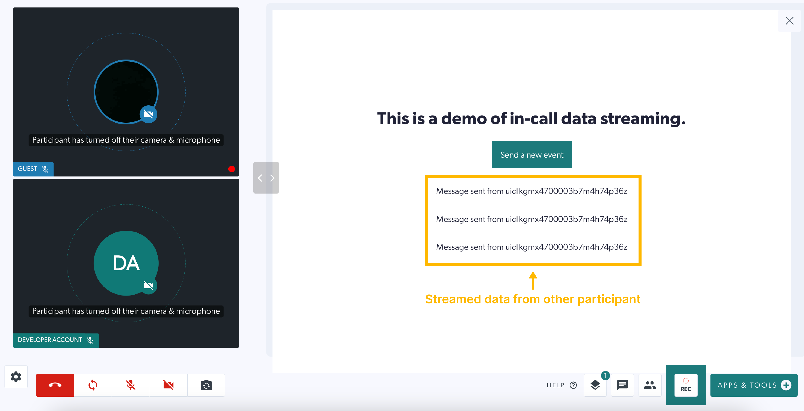
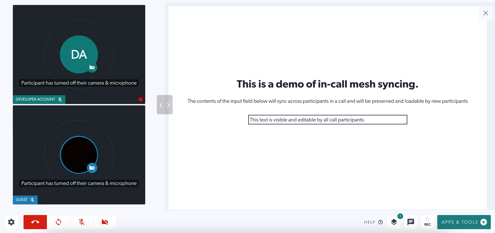
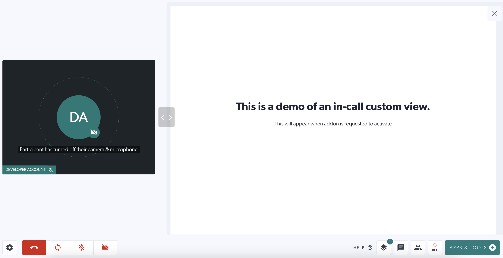
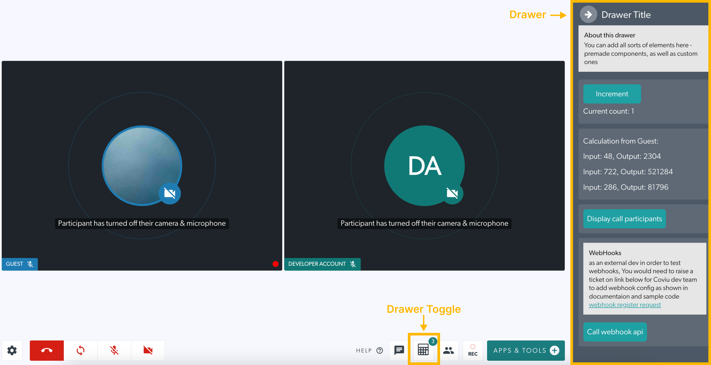
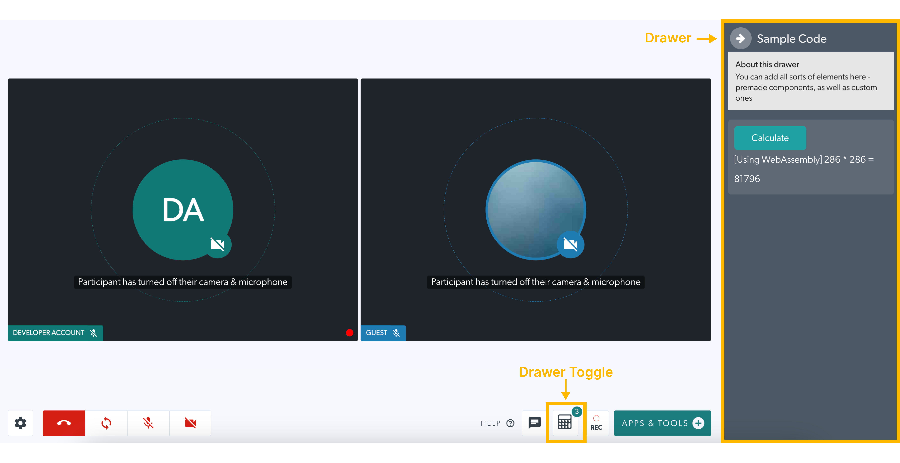

# Coviu Custom Plugin Examples

## Overview
This repo is an introduction to developing custom plugins for the Coviu platform. It contains 5 example plugins which display some of the possibilities when creating custom Coviu plugins, as well as useful resources to aid with development.

## Getting Started
### Build and Serve Plugin Locally
_Note: Addons are sometimes referred to as plugins in the code_
1. Either clone this whole repo, or clone a specific example plugin directory. More information about each example plugin can be found below.
2. In the root directory of your chosen example plugin, install the dependencies using `npm install`
3. Serve the plugin locally using `npm run start`. This will serve the built plugin at http://localhost:9100/plugin.js

### Using Your Plugin
#### Internal (Coviu) Developers
* [Plugin Development Steps](https://coviu.atlassian.net/wiki/spaces/TD/pages/285376535/Developing+a+new+plugin#Testing-the-plugin-locally)
#### External Developers
* [Coviu Add-on Documentation: Plugin Development Steps](https://coviu.readme.io/docs/technical-documentation#development-steps)

External developers, please refer to Coviu's official documentation (linked above) for details on how to set up a development environment to work on locally served plugins.

### Resources
* [Addon (aka plugins) Documentation](https://coviu.readme.io/docs) - this is to create new functionality for Coviu
* [Addon Discussion Board](https://coviu.readme.io/discuss) for asking and answering questions about Addons
* Note that [Session API documentation](https://coviu.readme.io/docs/api-object) is to embed Coviu video windows into your own software, and is _not_ the topic of this repo

## Example Plugins
### 1. In-call Data Stream Example
A datachannel stream (datastream) is a stream established between two call participants that allows for the exchange of raw byte data. It has no additional handing for the data it carries, there is no history mechanism in place, and intended for passing data between two participants as quickly as possible.

This example demonstrates in-call data streaming using a button which streams data to all other participants when clicked.

### 2. In-call Mesh Syncing Example
This example demonstrates using the call mesh. A synchronized state is maintained for all the plugins during the call. This is done using CRDT data-structures. A plugin on any peer can push state changes to the webRTC mesh causing those changes to propagate to all the peers. This is stored in resource.metadata

See the plugin API function api.resource.transaction() for how this is done.

This example demonstrates in-call mesh syncing using a text input which is editable by all participants of the call, and will update when any participant makes a change.

### 3. In-call View Example
This example demonstrates an in-call view which is non-interactive, but visible to all participants.

### 4. Pre-call & Post-call Views Example
Pre-call and post-call custom views are visible only to guests of a call. You can display anything you wish to a guest as they enter and/or leave a call.

This example demonstrates pre-call and post-call views which are visible to guests before and after the call.

### 5. Toggleable Drawer Example
This example demonstrates a custom drawer which can be toggled on/off in a call. The contents of the drawer can be rendered differently for Hosts and Guests of a call, with data able to be shared between Host and Guest.

#### Host View

#### Guest View

## Important Links 
* [Coviu Addon Marketplace](https://coviu.com/addons) where existing Addons can be seen
* [Coviu Developer Service Desk](https://coviu.atlassian.net/servicedesk/customer/portal/8) where you can request development environment access or support, raise bugs and feature requests, and submit your code