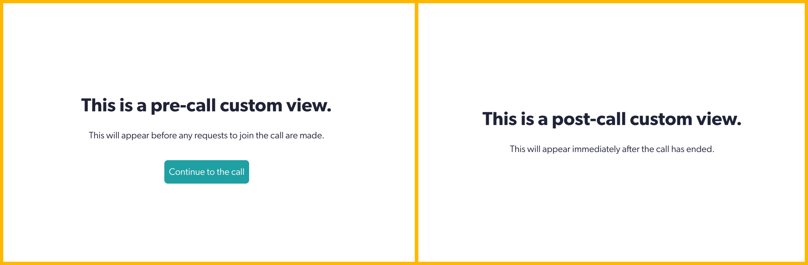

# Coviu Addons (aka Plugins)

## Walkthrough to create your own Addon

### Take a look of addon examples
#### Drawer & Toggle

#### In-call view

#### Pre-call & Post-call views (phases before entering the call and after leaving the call)

### Build and Serve Plugin locally
_Note: Addons are sometimes referred to as plugins in the code_
1. Clone one example from [Coviu Demo Plugin](https://github.com/coviu/coviu-addons)
2. Install the dependencies using `npm install`
4. Serve the plugin locally using `npm run start`. This will serve the built plugin at http://localhost:9100/plugin.js

### Register for Staging access
1. Register your email address at [Coviu Developer Service Desk](https://coviu.atlassian.net/servicedesk/customer/portal/8/group/13)
2. Log a ticket for Staging Sandbox Registration. We will reply with a link to register your Staging account

### Interact with the example Addon being served from your local
1. Log into your Staging account
2. Enter a call
3. Click the Calculator icon to see the demo addon being served from your local machine
4. Check the [Addon API documentation](https://coviu.readme.io/docs) - which is _different_ to the [Session API](https://coviu.readme.io/reference)

### (Optional) Register webhooks to access APIs external to Coviu
1. Review our [Webhook Architecture](https://coviu.readme.io/docs/webhook-documentation) 
2. Log a ticket with the list of webhooks you require at the [Coviu Developer Service Desk](https://coviu.atlassian.net/servicedesk/customer/portal/8)

### Deploy your Addon to be served from Coviu's Staging environment
1. Submit your code via a Source Code submission on [Coviu Developer Service Desk](https://coviu.atlassian.net/servicedesk/customer/portal/8)
2. You're now at "Code Review by Coviu" in the [Addon Development Process](https://github.com/coviu/coviu-addons/wiki/Addon-development-process)

## Full Documentation
* [Addon (aka plugins) Documentation](https://coviu.readme.io/docs) - this is to create new functionality for Coviu
* [Addon Discussion Board](https://coviu.readme.io/discuss) for asking and answering questions about Addons
* Note that [Session API documentation](https://coviu.readme.io/docs/api-object) is to embed Coviu video windows into your own software, and is _not_ the topic of this repo

## Important Links 
* [Coviu Addon Marketplace](https://coviu.com/addons) where existing Addons can be seen
* [Coviu Developer Service Desk](https://coviu.atlassian.net/servicedesk/customer/portal/8) where you can request development environment access or support, raise bugs and feature requests, and submit your code
